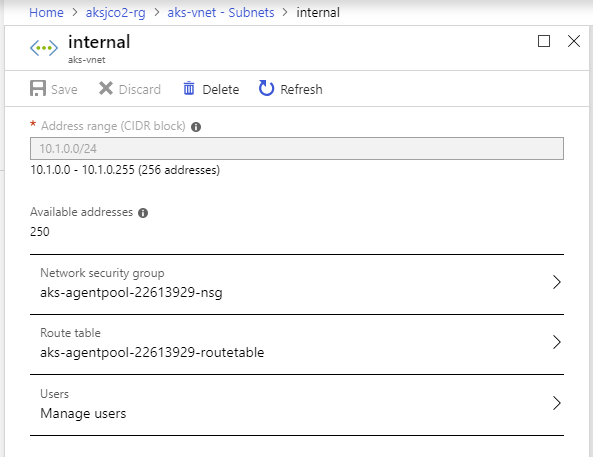

# Deploy AKS in custom VNET, with Kubenet plugin using Terraform

This repository contains all you need to use Terraform to deploy Azure Kubernetes Service with Kubenet plugin, inside a custom VNET.

It automatically creates:

* A resource group
* A virtual network with an address space of `10.1.0.0/16`
* A subnet named `internal` with an address range of `10.1.0.0/24` (where the AKS worker nodes will land)
* An Azure Kubernetes Service cluster

## How it works

All the AKS cluster definition is in the `tf/aks.tf` file. Some of the parameters are variable that can be overriden in the `tf/variables.tf` file.

When deploying Azure Kubernetes Service with Kubenet plugin inside a custom virtual network, there are additional steps required to attach the Network Security Group and Route Table to the subnet where the node are deployed.

This has been automated with the `tf/config-network.sh` script that is called by a Terraform provisionner after the AKS cluster has been created:

```hcl
provisioner "local-exec" {
    command = "./config-network.sh"

    environment {
        AKS_RG = "${var.resource_group_name}"
        AKS_VNET_RG = "${var.resource_group_name}"
        AKS_VNET_NAME = "${azurerm_virtual_network.vnet.name}"
        AKS_SUBNET_NAME = "${azurerm_subnet.subnet.name}"
    }
}
```

*NB: if you want to know more about those additional steps, read [this page](https://docs.microsoft.com/en-us/azure/aks/configure-kubenet) of the AKS docs.*

For the same reason, there are custom actions required when you want to remove the AKS cluster. You need to detach the NSG and Route Table before. This has also been implemented in this repository, using a destroy provisionner that will execute the `tf/clean-network.sh` script before removing the AKS resource:

```hcl
provisioner "local-exec" {
    when = "destroy"
    command = "./clean-network.sh"

    environment {
        AKS_VNET_RG = "${var.resource_group_name}"
        AKS_VNET_NAME = "${azurerm_virtual_network.vnet.name}"
        AKS_SUBNET_NAME = "${azurerm_subnet.subnet.name}"
    }
}
```

## How to deploy

You need to have Terraform installed and Azure CLI 2.0 installed, obviously.

Go to the `tf` directory:

```bash
cd tf
```

*Optional: update the `variables.tf` and `aks.tf` files with desired values.*

Export the following environment variables for the service principal client id and client secret that should be used by the Azure Kubernetes Service cluster:

```bash
export TF_VAR_client_secret=YOUR_CLIENT_SECRET
export TF_VAR_client_id=YOUR_CLIENT_ID
```

Initialize Terraform

```bash
terraform init
```

Plan the deployment:

```bash
terraform plan -out out.plan
```

Apply the plan to start the deployment:

```bash
terraform apply "out.plan"
```

Wait for the deployment to be completed.
Once done, go in the Azure portal, open the subnet where you've deployed the AKS cluster and check that the AKS NSG and Route Table have been assigned to it:



## How to destroy

Go to the `tf` directory:

```bash
cd tf
```

Call Terraform destroy:

```bash
terraform destroy
```